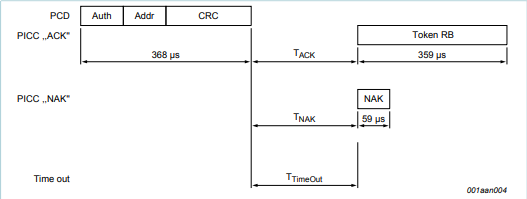
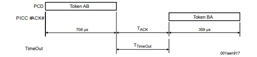

## Introduction

This repository expands on the [PN532-STM32-SecuritySystem](https://github.com/CorcKilian/PN532-STM32-SecuritySystem) project, focusing on low-level NFC communication and authentication protocols.

The primary objective of this project is to explore the implementation of the **MIFARE Classic 3-pass authentication protocol** using an **STM32 microcontroller** interfaced with a **PN532 NFC module** over SPI. Unlike typical high-level library abstractions, this project delves into the internal mechanics of the authentication process, providing a clear, step-by-step approach to understanding how MIFARE Classic cards perform mutual authentication, as well as partially performing a low level 3 pass Authentification sequence.

After successful high level authentication, the system performs secure **read and write operations to specific memory blocks** on the MIFARE card. This enables practical applications such as access control, secure data storage, and card-based identification systems.

## Motivation: Why This Project Matters

The primary motivation behind this project is to **demystify the internal workings of MIFARE Classic authentication** and provide a hands-on, low-level understanding of **NFC security protocols** beyond high-level abstractions. While countless libraries and commercial tools offer seamless NFC communication, they often hide the underlying mechanics that govern security-critical processes like authentication and encryption.

By intentionally working at the **lowest possible protocol layer**, this project serves several key purposes:

### 1. **Educational Value: Understanding the Black Box**

MIFARE Classic cards are ubiquitous in access control, transportation, and identification systems worldwide. However, their authentication protocol is proprietary and historically opaque. Reverse-engineering the **3-pass mutual authentication** process fosters a deeper understanding of:
- ISO14443A communication layers.
- Crypto1 stream cipher mechanics.
- Real-world application of LFSRs in cryptographic protocols.
- Practical RF-layer packet framing, CRC, and parity handling.

For embedded developers and security researchers, this knowledge bridges the gap between **"it works"** and **"I understand why it works"**.

### 2. **Security Research: Exposing Weaknesses**

Despite being widely used, MIFARE Classic's security has been proven vulnerable for over a decade. Tools like Proxmark3 and attacks like **nested key recovery** and **darkside attacks** have demonstrated practical exploitation of these weaknesses.

This project aims to:
- Replicate key recovery techniques from scratch on constrained hardware.
- Highlight the limitations of the Crypto1 cipher.
- Showcase how even low-cost microcontrollers can perform meaningful cryptanalysis when given raw protocol access.

By doing so, it reinforces the critical lesson that **"security through obscurity" is not security at all**.

### 3. **Resource-Constrained Embedded Applications**

In the realm of embedded systems, developers often face severe resource constraints:
- Limited Flash and RAM.
- Restricted processing power.
- Tight real-time performance requirements.

Implementing complex cryptographic protocols like Crypto1 without relying on memory-heavy lookup tables forces creative solutions:
- Bit-serial LFSR implementations.
- Efficient SPI data handling.
- Precise RF-layer control via PN532 registers.

These skills are directly transferable to other domains where **lightweight cryptography** and **resource-efficient communication** are paramount.

### 4. **Real-World Impact: Assessing Access Control Security**

Many institutions, including schools, public transport, and corporate offices, continue to rely on MIFARE Classic cards for access control. By demonstrating how these systems can be probed, analyzed, and potentially compromised using only low-cost hardware, this project raises awareness of:
- The ease of key recovery with basic tools.
- The importance of upgrading to secure alternatives (e.g., MIFARE DESFire EV2/EV3).
- The risks of relying on deprecated cryptographic standards.

### 5. **Platform for Future Research**

Beyond immediate goals, the project lays the groundwork for:
- Implementing **nested key recovery** in constrained environments.
- Exploring **side-channel analysis** (timing, fault injection) on NFC tags.
- Building lightweight cryptographic primitives for embedded security research.

### TL;DR: The Why in One Sentence

> *This project is about pulling back the curtain on MIFARE Classic authentication, exposing its weaknesses through hands-on low-level experimentation, and proving that meaningful NFC cryptanalysis is achievable on even the most resource-constrained embedded platforms.*


## Theory

### MIFARE Classic 3-Pass Authentication

MIFARE Classic cards use a proprietary 3-pass mutual authentication protocol based on the Crypto1 stream cipher. The goal of this protocol is to verify that both the reader and the tag possess a shared secret key (Key A or Key B) before granting access to specific memory sectors.

The authentication process follows these steps:



1. **Reader → Tag**:  
   The reader sends an authentication command:
   - `0x60` for Key A or `0x61` for Key B
   - Target block address
   - CRC

2. **Tag → Reader**:  
   The tag replies with a 32-bit random number (`R_B`), acting as its challenge.



3. **Reader → Tag**:  
   The reader computes an 8-byte response:
   - Encrypts the tag's challenge `R_B` with the shared secret key.
   - Appends its own 32-bit random number `R_A`, rotated left by 1 bit.
   - Sends `E_K(R_B || R_A')` back to the tag.

4. **Tag → Reader**:  
   The tag responds with `E_K(R_A'')`, which is the reader's nonce rotated again and encrypted.
   - The reader verifies this to confirm mutual authentication.

After successful authentication, a secure session is established. All subsequent communication, including read and write operations, is encrypted using the active Crypto1 cipher stream.

In summary:
- **Reader initiates** the authentication and proves knowledge of the key.
- **Tag responds** with challenges and verifies the reader’s knowledge.
- Only after mutual verification can memory operations proceed.

## Nested Attack Theory

The **Nested Attack** is a cryptanalytic method used to recover secret keys from MIFARE Classic tags by exploiting weaknesses in the **Crypto1 stream cipher**. Unlike simple replay attacks, the nested attack involves authenticating to sectors where the attacker already knows the key, then leveraging this trusted state to extract keys from other sectors.

### The Principle of Nested Attacks

- MIFARE Classic uses a 48-bit secret key and the proprietary **Crypto1 cipher** for authentication.
- When a tag authenticates with a reader, it initializes Crypto1 with the secret key and the XOR of the UID and tag-generated random nonce (`Rb`).
- The tag and reader then perform a 3-pass challenge-response exchange, encrypting and decrypting values using a shared keystream.
- The **nested attack** uses a sector where the attacker knows the key to initialize the tag into a known cipher state.
- From this known state, the attacker can predict keystream bits, which allows manipulation of further authentication requests to recover unknown keys for other sectors.

### Intended Use in This Project

My goal was to capture:
1. The tag’s **random nonce (`Nt`)**.
2. The encrypted responses exchanged during authentication.
3. Synchronize a **Crypto1 LFSR implementation** with the tag’s internal state to decrypt these exchanges.
4. Apply the nested attack method to extract secret keys from target sectors.

### Challenges Encountered

While I successfully retrieved `Nt` and managed manual control of the authentication flow up to this point, fully implementing Crypto1 was blocked by hardware constraints:
- The standard Crypto1 implementation ([mfcuk/crypto1.c](https://github.com/nfc-tools/mfcuk/blob/master/src/crypto1.c)) uses large lookup tables for efficient keystream generation.
- My microcontroller lacked sufficient flash storage to accommodate these tables — exceeding capacity by nearly **1 MB**.
- Attempts to rewrite Crypto1 using bitwise-only operations proved impractical without known-good encrypted data for verification (for testing).
- Tools for live testing Crypto1 encryption correctness were unavailable, as PN532's encryption functionality is only accessible after successful authentication (a catch-22).

### Current State of Implementation

- The low-level process for **capturing `Nt`** was implemented and verified (of which I am very proud).
- Frame construction, parity handling, and CRC management were functional.
- The critical remaining step — **correct Crypto1 encryption/decryption** — could not be completed within hardware constraints and project timelines.

### Conclusion

The groundwork for a full nested attack was laid:
- Capturing `Nt` reliably.
- Constructing custom authentication frames manually.
- Receiving and processing raw encrypted tag responses.

However, without a feasible Crypto1 implementation on the STM32, the final keystream synchronization and key recovery phases remained out of reach.

Despite this, the project achieved a deep dive into MIFARE Classic's authentication mechanics, exposing practical challenges of low-level NFC security research on constrained embedded platforms.

### PN532 Commands for Authentication

The PN532 communicates with MIFARE Classic cards via commands defined by the NFC standard and its own instruction set.

The typical authentication sequence involves:

1. **InListPassiveTarget (0x4A)**  
   - Initializes communication and selects the target tag.
   - Returns a Target Number used for further commands.

2. **InDataExchange (0x40)**  
   - Used to send a MIFARE Classic authentication request.
   - Frame format:
     - `0x60` or `0x61` (Key A or B)
     - Block address
     - Key bytes (6 bytes, already stored on PN532)
     - UID (4 bytes)
   - PN532 handles the 3-pass exchange internally and reports success/failure.

For advanced control, **InCommunicateThru (0x42)** can be used to manually send raw frames, effectively turning the PN532 into a transparent transceiver.

To fully control the bit-level behavior of the PN532, several configuration steps are required:

- **Disable CRC generation/checking**:  
  - Clear `TxCRCEn` in `CIU_TxMode` register.
  - Clear `RxCRCEn` in `CIU_RxMode` register.

- **Disable Parity handling**:  
  - Set `ParityDisable` in `CIU_ManualRCV` register.

- **Control partial byte transmission**:  
  - Adjust `TxLastBits` in `CIU_BitFramingReg` to specify how many valid bits are in the final byte (e.g., for non-byte-aligned commands).

These settings are applied using the **WriteRegister** command before issuing `InCommunicateThru`. This allows precise control over the PN532's RF interface, essential for manual 3-pass authentication experiments, protocol fuzzing, or cryptanalysis.


## Usage Examples

### Reading a Block After Authentication

Once a MIFARE Classic sector is successfully authenticated (via InDataExchange or manual methods), the PN532 can read a specific block using InDataExchange.

The typical read command frame is:

- `0x40` → InDataExchange command
- Target Number from InListPassiveTarget
- `0x30` → MIFARE Read command
- Block Address (0x00 - 0x3F)

Example:

```c
uint8_t read_block_cmd[] = {
    0x40,                    // InDataExchange
    tag_info.target_number,  // Target number
    0x30,                    // MIFARE Read command
    0x08                     // Block address (example: block 8)
};

PN532_sendRawPrint(read_block_cmd, sizeof(read_block_cmd));
```

The PN532 will respond with 16 bytes of block data if successful.

### Writing to a Block After Authentication

Writing to a block requires sending a MIFARE Write command followed by 16 bytes of data to write.

The typical write command frame is:

- `0x40` → InDataExchange
- Target Number from InListPassiveTarget
- `0xA0` → MIFARE Write command
- Block Address

Example:

```c
uint8_t write_block_cmd[] = {
    0x40,                    // InDataExchange
    tag_info.target_number,  // Target number
    0xA0,                    // MIFARE Write command
    0x08,                     // Block address (example: block 8)
     // 16 bytes of data to write
    0xDE, 0xAD, 0xBE, 0xEF, 0x00, 0x01, 0x02, 0x03,
    0x04, 0x05, 0x06, 0x07, 0x08, 0x09, 0x0A, 0x0B
};

PN532_sendRawPrint(write_block_cmd, sizeof(write_block_cmd));
```

If the operation is successful, the PN532 will respond with a status OK response (0x00).

### Important Notes

- The block address must be within an authenticated sector.
- Sector trailer blocks (the last block in each sector) should be handled carefully as they contain key data and access bits.
- Authentication must be redone if the card or sector changes.

### Summary Flow

1. Authenticate sector with InDataExchange or manual 3-pass method.
2. Issue Read or Write commands using InDataExchange.
3. Verify PN532 responses for success/failure.


By disabling automated CRC, parity, and adjusting bit framing, the PN532 becomes a transparent ISO14443A transceiver, giving full control of low-level data exchanges to the microcontroller.

### Usage of Low Level Commands

This project provides low-level functions to directly interface with the PN532 registers and send raw data frames for precise control during authentication experiments or protocol analysis.

#### Setting and Modifying Registers

Registers can be read, written, and modified using helper functions:

**Reading a Register:**

```c
uint8_t rxmode_val;
if (read_registerGeneric(0x63, 0x03, &rxmode_val)) {
    printf("CIU_RxMode (0x6303): 0x%02X\n", rxmode_val);
}
```

**Writing to a Register:**

```c
write_registerGeneric(0x63, 0x02, 0x00);  // Disable TxCRCEn in CIU_TxMode
```

**Modifying Specific Bits:**

```c
modify_registerGeneric(0x63, 0x0D, (1 << 4), (1 << 4));  // Set ParityDisable in CIU_ManualRCV
modify_registerGeneric(0x63, 0x3D, 0x07, 0x05);          // Set TxLastBits to 5 bits in CIU_BitFramingReg
```

These allow precise control over PN532's link layer behavior.

#### Sending Raw Commands: sendRawPrint()

`PN532_sendRawPrint()` sends a command body (excluding TFI), waits for ACK, and prints the raw response bytes.

**Example: Sending REQA Command via InCommunicateThru**

```c
uint8_t reqa_cmd[] = { 0x42, 0x26 };  // InCommunicateThru + REQA

PN532_sendRawPrint(reqa_cmd, sizeof(reqa_cmd));
```

This function prints the full PN532 response, useful for debugging low-level exchanges.

#### Sending Raw Commands and Receiving Parsed Payload: sendRawGet()

`PN532_sendRawGet()` sends a command, waits for ACK, and returns the response payload (excluding protocol headers) in a user-provided buffer.

**Example: Reading CIU_Status1 Register**

```c
uint8_t readreg_cmd[] = { 0x06, 0x63, 0x3F };  // ReadRegister for CIU_Status1
uint8_t payload[16];
uint8_t payload_len = 0;

if (PN532_sendRawGet(readreg_cmd, sizeof(readreg_cmd), payload, &payload_len)) {
    printf("CIU_Status1 (0x633F): 0x%02X\n", payload[0]);
}
```

#### Typical Low-Level Workflow
1. Configure registers as needed (CRC disable, parity disable, TxLastBits).
2. Use `PN532_sendRawPrint()` for exploratory communication with full debug output.
3. Use `PN532_sendRawGet()` when you need to extract and process specific response payloads.
4. After low-level experiments, restore defaults with:
   
```c
restore_link_layer_defaults();
```

#### Key Points
- All register addresses follow the 0x63xx space for CIU.
- Read/write/modify helpers abstract the frame building for ReadRegister/WriteRegister commands.
- `sendRawPrint` is for quick testing with printed results.
- `sendRawGet` is for structured data extraction.
- 


## Issues Encountered

During the development of the low-level MIFARE Classic 3-pass authentication, one of the most time-consuming and frustrating challenges was retrieving the tag's random nonce (`Nt`) during the second pass of the authentication process.

### The Problem: Static Nonces, Identical Responses

Despite carefully constructing authentication requests, the PN532 consistently returned the same 4-byte response:

```
00 90 80 A2
```

This occurred across multiple tags I tested, showing no signs of randomness. Both tags exhibited this exact same behavior, making it impossible to proceed with manual authentication.

At first, I assumed a protocol or implementation error on my side. I reviewed every single detail—transmission order, bit significance, CRC configurations, parity, timings, endianness—iterating endlessly between little-endian and big-endian variants. I modified every variable I could think of, yet the result remained unchanged.

### The Investigation: Exhaustive Debugging

In pursuit of a solution, I developed code to read and print out **every possible PN532 register value**, meticulously comparing them against expected states from the datasheet and related NFC documents. I reviewed every register in the CIU address space:

```c
Read_TransReg();
Read_RxModeReg();
disableRxCRC();
Read_RxModeReg();
read_SPIcontrol_register();
```

I utilized **PN532_scanForTag()** followed by a complete **dump of radio settings**:

```c
if (PN532_scanForTag(&tag)) {
    dumpRadioSettings();
}
```

I even configured the **CIU Timer Prescaler** to its maximum to test for potential timing issues:

```c
PN532_setTimerPresetMax();
```

Every possible avenue was explored. I read through the entire set of available resources on MIFARE Classic, including datasheets, technical papers, and obscure forum threads. After exhausting Google searches and cross-referencing academic papers, I found that **practically no one online had documented manual MIFARE 3-pass authentication at this level**—especially not with raw PN532 InCommunicateThru mode.

### The Revelation: Clone Cards

After days of this relentless debugging, I tried scanning a different tag — specifically, a **college-issued ID badge**.

Suddenly, the behavior changed.

For the first time, I received **properly randomized 4-byte nonces** from the tag. It was then I realized the prior two cards must have been **cheap MIFARE clone cards** — they likely lacked the hardware-based pseudo-random number generator (PRNG) necessary to generate dynamic challenges.

This explained why they kept returning static values (`00 90 80 A2`), even though my code and PN532 setup were functionally correct.

### Lessons Learned

- The cards themselves were the issue, not the code.
- Clone MIFARE cards can silently break low-level authentication workflows by returning static responses.
- The lack of community examples on manual 3-pass authentication made this issue especially hard to diagnose.
- Hours of register dumps, timing tweaks, and bitwise debugging were invested chasing a problem that was, in the end, **physical hardware-related**.

### Takeaway

This experience highlighted how **hardware assumptions can waste dozens of hours** (I estimate at least 35-40hrs on this issue alone) when working at a low protocol level. Even with exhaustive software-side debugging, sometimes the answer lies in the silicon.

A subtle issue, an enormous detour.

## Crypto1 Encryption Challenges

While I successfully retrieved the tag’s random nonce (`Nt`) during the authentication process — ironically verified thanks to the clone cards consistently returning static `Nt` values — the next critical step proved far more difficult: handling **Crypto1 encryption**.

### The Task: Encrypting R_B and Synchronizing the LFSR

After receiving `Nt`, the authentication process requires encrypting the tag's challenge (`R_B`) and appending the reader's random nonce (`R_A`) rotated by one bit. This step involves synchronizing a **Linear Feedback Shift Register (LFSR)** with the card's internal state, producing the correct keystream to encrypt outgoing data and decrypt incoming responses.

I implemented the necessary transmission:
- Sending `R_B` with CRC and manually handled parity bits.
- Receiving encrypted data back from the card.
- Stripping parity bits from the response for analysis.

However, to proceed, I needed to simulate the **Crypto1 stream cipher** on my microcontroller.

### The Problem: Memory Limitations and Lookup Tables

The standard **Crypto1 implementation** (e.g., [mfcuk's crypto1.c](https://github.com/nfc-tools/mfcuk/blob/master/src/crypto1.c)) relies heavily on **large lookup tables** for performance. These tables facilitate quick LFSR state updates and keystream generation.

Unfortunately, my embedded platform did not have the luxury of such memory:
- The lookup tables alone would have exceeded available flash by nearly **1 MB**.
- Including them would have made the firmware unbuildable.

### Attempted Solutions

I tried to:
- Reduce lookup table sizes through partial generation.
- Rewrite the Crypto1 algorithm to use bitwise operations instead of tables.
- Adjust data packing to reduce overhead.
- Test alternative minimalistic implementations (none fit within size constraints).

Critically, without a known-good encrypted payload example (properly packed with parity bits), there was no reliable reference to validate my implementation against.

### Dead-End: No Way to Verify Encryption

I explored the possibility of offloading encryption to the **PN532** itself. However, this was only possible **after successful sector authentication**, which inherently required Crypto1 to work in the first place — a circular dependency.

Without a functioning encryption module and no external tool to verify my cipher output, debugging became infeasible.

### The Hard Pivot: Switching to High-Level Commands

With the project deadline approaching, I had to make the difficult decision to pivot:
- I excluded my non-functioning Crypto1 implementation from the final project.
- However, I retained the low-level process for capturing `Nt`, including manual parity handling and CRC generation.
- The foundational work for a **nested attack** was laid out — I could capture half the authentication process, but lacked the encryption layer to complete it.

### Final Thought

In the end, I was halfway to a full manual MIFARE Classic authentication attack. Capturing `Nt` was successful, but generating the correct encrypted response without Crypto1 functioning left the process incomplete.

Given the tight resource constraints of the STM32 and the lack of lightweight Crypto1 libraries, this hurdle remained unresolved within the project timeline.

## Conclusion

This project provided an in-depth exploration of the **MIFARE Classic 3-pass authentication protocol**, focusing on low-level NFC communication through direct interaction with the **PN532 NFC module** and an **STM32 microcontroller**.

Key achievements include:
- Implementation of low-level SPI communication with the PN532.
- Manual control of authentication frame construction, including CRC and parity bit handling.
- Successful capture of the tag's **random nonce (Nt)** using **InCommunicateThru** mode.
- Comprehensive register-level control of the PN532 for transparent transceiver operations.
- Development of diagnostic tools to read and verify internal PN532 registers.
- A clear understanding of the MIFARE Classic authentication flow and its vulnerabilities.

While the manual implementation of the **Crypto1 cipher** was ultimately infeasible due to hardware resource constraints, I pivoted to an alternative approach:  
Using the PN532's **InDataExchange** command to perform authentication on sectors where keys were already known.

This allowed me to successfully:
- Authenticate to MIFARE Classic sectors using known keys.
- Perform **read and write operations to memory blocks**.
- Demonstrate typical applications such as **access control emulation**, similar to how commercial card readers verify credentials for building or room access.

Remaining challenges included:
- Inability to implement Crypto1 for unknown key recovery on constrained hardware.
- No available tools to verify encrypted payload correctness at the bit level.
- The discovery that clone tags lacking proper PRNG functionality severely hindered testing.

Despite these hurdles, the project accomplished its goal of providing a **deep understanding of the MIFARE Classic authentication process** and practical NFC operations.  
The foundational work for a future **nested attack implementation** remains in place.

With access to hardware capable of handling the computational demands of Crypto1, completing the manual authentication attack and key recovery remains a viable and exciting extension of this work.

In summary:
- Low-level control was achieved and verified.
- High-level MIFARE commands were used successfully for authenticated block read/write operations.
- The system effectively emulates real-world NFC access systems when working with known keys.

This project bridged both protocol-level analysis and practical embedded NFC application development, providing valuable insights into **NFC security research on constrained microcontrollers**.

## Future Work: Minimalist Crypto1 for Offline Key Recovery

While hardware limitations prevented a full-featured Crypto1 implementation using traditional lookup tables, there remains a viable path to achieve **offline MIFARE Classic key cracking** through a **lightweight, bit-serial Crypto1 implementation** combined with carefully captured authentication data.The final missing piece for full key recovery is a lightweight, MCU-friendly Crypto1 implementation enabling offline attacks from captured auth data.

### Bit-Serial Crypto1 Keystream Synchronization

The standard Crypto1 implementation accelerates state updates and keystream generation through large precomputed lookup tables. However, Crypto1 itself is fundamentally a **48-bit Linear Feedback Shift Register (LFSR)** with deterministic feedback logic.

For constrained embedded platforms like the STM32, a **bit-serial LFSR implementation** can replicate Crypto1's keystream generation using only bitwise operations:
- **One LFSR update per keystream bit**, purely shift/XOR based.
- No lookup tables, minimal RAM (~64 bytes total for state).
- Tradeoff: slower keystream generation, acceptable for small-scale attacks.

This method allows:
- Real-time generation of keystream bits for encryption/decryption.
- Synchronization with the tag’s cipher state during authentication.
- Feasible use on microcontrollers with tight memory constraints.

### Capturing the Final Authentication Response

With `Nt` successfully captured, the next objective is to retrieve the tag’s **encrypted response (`E_K(RA'')`)** after sending the reader challenge:
- Reader sends `E_K(RB || RA')`.
- Tag responds with `E_K(RA'')`.
- Capturing this response allows direct extraction of keystream bits.

Using **InCommunicateThru** with manual CRC and parity disabled provides the required access to raw RF data, enabling accurate bit-level capture of the tag's encrypted responses.

### Offline Key Cracking Workflow

With the captured authentication data and a minimalist Crypto1 model, the following steps outline the offline key recovery process:

1. **Known-Key Sector Authentication**:
   - Authenticate to a sector with a known key.
   - Synchronize the bit-serial Crypto1 model to validate correct keystream output.

2. **Unknown-Key Sector Probe**:
   - Initiate 3-pass authentication to the target sector.
   - Capture `Nt` and encrypted response frames.
   - Derive keystream bits from observed ciphertext.

3. **Offline Key Search**:
   - Use recovered keystream bits to perform an **offline brute-force key search**.
   - Exploit keystream predictability to drastically reduce search space.
   - The search can be offloaded to a PC or optimized microcontroller routine.

4. **Key Validation**:
   - Once candidate keys are found, attempt authentication to verify.
   - Upon success, enable read/write access to the targeted sector.

### Optimizations & Extensions

- **DMA-accelerated SPI transactions** to optimize communication throughput.
- **Keystream caching** for repeated sector attacks without redundant computation.
- **Partial keystream attacks** for multi-sector key recovery with minimal overhead.
- Consider integrating an external co-processor (e.g., FPGA, ESP32) for brute-force acceleration if MCU cycles are limited.

### Feasibility Assessment

Though slower than table-driven implementations, a bit-serial Crypto1 cipher is computationally manageable for targeted attacks:
- Suitable for proof-of-concept sector cracking.
- Requires no additional flash storage beyond core firmware.
- Aligns with embedded NFC research goals: minimalistic yet effective.

With this approach, the project could achieve **offline key recovery from captured authentication exchanges**, bypassing the original hardware memory limitations while preserving the educational and practical objectives of low-level NFC security research.

## References

1. **MIFARE Classic EV1 1K Datasheet**  
   NXP Semiconductors, *MIFARE Classic EV1 1K - Mainstream contactless smart card IC for fast and easy solution development*, Rev. 3.2, May 2018.  
   [https://www.nxp.com/docs/en/data-sheet/MF1S50YYX_V1.pdf](https://www.nxp.com/docs/en/data-sheet/MF1S50YYX_V1.pdf)

2. **PN532 NFC Controller Datasheet**  
   NXP Semiconductors, *PN532/C1 Near Field Communication (NFC) controller*, Rev. 3.6, Nov. 2017.  
   [https://www.nxp.com/docs/en/nxp/data-sheets/PN532_C1.pdf](https://www.nxp.com/docs/en/nxp/data-sheets/PN532_C1.pdf)

3. **PN532 User Manual**  
   NXP Semiconductors, *PN532 User Manual*, UM0701-02, Rev. 02, Nov. 2007.  
   [https://www.nxp.com/docs/en/user-guide/UM0701.pdf](https://www.nxp.com/docs/en/user-guide/UM0701.pdf)

4. **STM32L432KC Reference Manual**  
   STMicroelectronics, *STM32L41xxx/42xxx/43xxx/44xxx/45xxx/46xxx advanced Arm®-based 32-bit MCUs - Reference Manual*, RM0394, Rev. 4, Oct. 2018.  
   [https://www.st.com/resource/en/reference_manual/rm0394-stm32l41xxx42xxx43xxx44xxx45xxx46xxx-advanced-armbased-32bit-mcus-stmicroelectronics.pdf](https://www.st.com/resource/en/reference_manual/rm0394-stm32l41xxx42xxx43xxx44xxx45xxx46xxx-advanced-armbased-32bit-mcus-stmicroelectronics.pdf)

5. **STM32L432KC Datasheet**  
   STMicroelectronics, *STM32L432KB, STM32L432KC - Ultra-low-power Arm® Cortex®-M4 32-bit MCU+FPU, 100DMIPS, up to 256KB Flash, 64KB SRAM, USB FS, analog, audio*, DS11451, Rev. 4, May 2018.  
   [https://www.st.com/resource/en/datasheet/stm32l432kc.pdf](https://www.st.com/resource/en/datasheet/stm32l432kc.pdf)

6. **MIFARE Cryptanalysis Paper**  
   Flavio D. Garcia, Peter van Rossum, Roel Verdult, Ronny Wichers Schreur, "Wirelessly Pickpocketing a Mifare Classic Card
," Radboud University Nijmegen, The Netherlands.  
   
